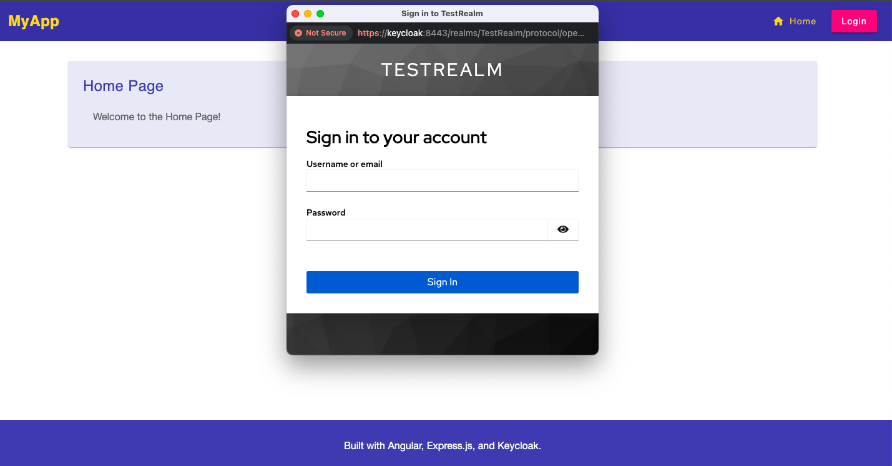

# Secure BFF Authentication System



Modern authentication implementation using [Angular, Express.js BFF, and Keycloak](https://blog.brakmic.com/keycloak-angular-and-the-bff-pattern/) with complete client-side token isolation.

## Components

- **Frontend**: Angular 19 SPA (port 4200)
- **BFF**: Express.js backend (port 3000)
- **Keycloak**: v26 IAM server (port 8443)
- **Docker**: Compose setup with network isolation

## Prerequisites

- Docker 20.10+
- Node.js 18.x
- OpenSSL (for certificate generation)

## Quick Start

```bash
git clone https://github.com/brakmic/Angular-BFF-Keycloak
cd Angular-BFF-Keycloak

# Generate certificates (optional)
./scripts/setup_ssl.sh

# Start services
cd keycloak
docker-compose up -d

# Install frontend & backend dependencies
cd frontend && npm install
cd backend && npm install
```

## Configuration

### Environment Variables

`.env` (BFF):
```ini
KEYCLOAK_REALM=TestRealm
KEYCLOAK_AUTH_SERVER_URL=https://keycloak:8443
KEYCLOAK_CLIENT_ID=angular-public-client
KEYCLOAK_CALLBACK_URL=https://localhost:3000/auth/keycloak/callback
BFF_LOGOUT_CALLBACK_URL=https://localhost:3000/auth/logout/callback
COOKIE_ORIGIN=https://localhost:4200
SESSION_DOMAIN=.your-domain.com  # only when running in a multi-domain environment
NODE_TLS_REJECT_UNAUTHORIZED=0 # when using self-signed certificates
```

`proxy.conf.json` (Angular):  // optional
```json
{
  "/api": {
    "target": "https://localhost:3000",
    "secure": false,
    "changeOrigin": true,
    "logLevel": "debug"
  },
  "/auth": {
    "target": "https://localhost:3000",
    "secure": false,
    "changeOrigin": true,
    "logLevel": "debug"
  }
  
}
```

### Certificates (for manual certificate imports)
1. Place server certificates in `/certs`
2. Trust root CA certificate:
```bash
sudo cp certs/your-ca.cert.pem /usr/local/share/ca-certificates/
sudo update-ca-certificates
```

## Keycloak Setup (for manual realm imports)

1. Access admin console: `https://localhost:8443`
2. Import `your-realm.json`
3. Create user: `your-user` / `your-password`

## Usage

1. Start services: `docker-compose up -d`
2. Launch Angular: `npm start` (from frontend dir)
3. Access: `https://localhost:4200`

**Authentication Flow**:
1. Click Login -> Secure popup opens
2. Complete Keycloak authentication
3. Session established via HTTP-only cookies
4. Access protected routes

## Development

```bash
# BFF hot-reload
npm run dev

# Frontend build
npm run build

# Keycloak realm update
docker-compose restart keycloak
```

## Customization

- Modify `docker-compose.yml` Keycloak settings
- Customize Keycloak theme in `/keycloak/themes`
- Update Angular routes in `app.routes.ts`
- Modify Angular `AppSettings` interface in app.config.ts
- Extend BFF endpoints in `index.ts`

## Troubleshooting

**Certificate Errors**:
```bash
# Reinstall CA certificate
sudo trust anchor --remove certs/ca.cert.pem
sudo trust anchor certs/ca.cert.pem
```

**Clean Reset**:
```bash
docker-compose down -v
rm -rf node_modules
```

## License

[MIT](./LICENSE)
